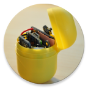

# Analyse von Schüttgutverhalten unter Verwendung von integrierter Sensorik

![Intelligente Sensor-Aktor-Systeme (ISAS), KIT] (http://isas.uka.de/skins/ISAS_media/LOGO-de/ISAS_logo.png)

[Praktikum Forschungsprojekt: Anthropomatik praktisch erfahren (SS 2016)](http://isas.uka.de/Praktikum/de?uselang=de) 
***

### Inhalt von ue-ei

1. dokumentation: 
  * [Latex-Dokumentation](dokumentation) des Projektes
  * [Finale PDF-Dokumentation](dokumentation/Praktikumsdokumentation_Bittner_Kucza.pdf)

2. client:
 * [Android App](client/adafruit_android_ble_uart_extended/), BLE-Verbindung zwischen Smartphone und Adafruit Pro Trinket, Empfangen und Speichern der gemessenen Daten
 * [Analyse Tool](client/ui/), Python, Aufbereitung und Visuelle Darstellung der Daten für Analyse 

3. microcontroller:
 * [Quellcode für Adafruit Pro Trinket](microcontroller/orientation_via_bluetooth_4proTrinket_with_commands/) (instrumentiertes Schüttgut), Messen und Senden von Beschleunigungs- und Orientierungswerte

4. data:
   // gemessene Sensordaten an der FlexSort-Anlage
 * [07.07.2016 Erster Messlauf](data/070716_Erster_Messlauf), drei verschiedene Verpackungsarten
   * [Aufbereitete Daten vom 07.07.2016 Erster Messlauf](data/070716_Erster_Messlauf_Daten_Aufbereitet) durch Analyse Tool
 * [07.07.2016 Testmessung des Sensors danach](data/070716_Nach_Erstem_Messlauf_Test_Controller/)
 * [18.07.2016 Zweiter Messlauf](data/180716_Zweiter_Messlauf/), vierte Verpackungsart

5. [Datenformat](dataformat.pdf) der gespeicherten Tupel

***

